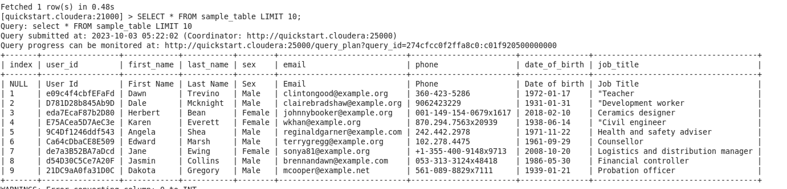

# Impala Data Querying with Hive Connector

## Overview

This project demonstrates how to import a CSV file into Hive, create a table for it, and then query the data using Impala via the Hive JDBC connector from a Java application.

## Technologies Used

- **Hive**: Data warehouse software for creating, querying, and managing large datasets.
- **Impala**: Real-time query engine for Apache Hadoop.
- **Java**: Programming language used for the querying API.

## Steps

### 1. Import CSV into Hive

First, upload your CSV file into HDFS:

```bash
hdfs dfs -put ./test_db.csv /user/hive/warehouse/
```

### 2. Create Database

```bash
impala-shell

CREATE DATABASE IF NOT EXISTS test_db;
USE test_db;
```

### 3. Create Table

```bash
CREATE TABLE employee_table (
   `Index` INT,
   `User_Id` STRING,
   `First_Name` STRING,
   `Last_Name` STRING,
   `Sex` STRING,
   `Email` STRING,
   `Phone` STRING,
   `Date_of_birth` STRING,
   `Job_Title` STRING
   )
   ROW FORMAT DELIMITED
   FIELDS TERMINATED BY ','
   STORED AS TEXTFILE;
```

### 6. Load Data

```bash
LOAD DATA INPATH '/user/hive/warehouse/test_db.csv' INTO TABLE employee_table;
```

### 7. Run Queries

```bash
SELECT * FROM employee_table LIMIT 10;
```


